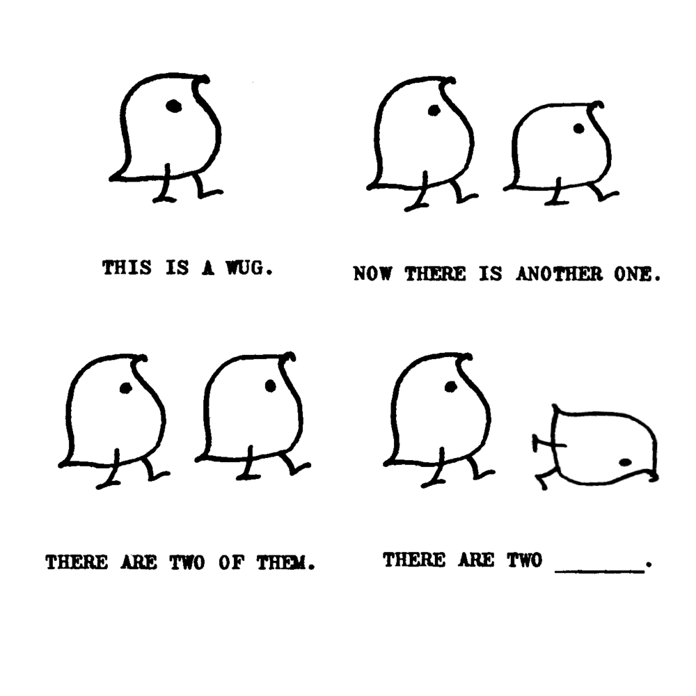

## Is the Test Measuring the Student, or the Test Design?
Imagine two students are asked to solve a puzzle. We want to who is better at solving puzzles based on who gets to solve it first. One student gets the pieces laid out neatly on a table. The other one has to find the pieces hidden in a dark room first. If the second student takes longer, is it because they are worse at puzzles, or because the room was too dark? Here is a simple but vital question: Does the test format change how well a student performs?

This project investigates this question within the context of measuring "morphological awareness (MA)". The question we asked was whether the test format of existing morphological awareness tasks in psycholinguistics affect their performance in differentiating test takers' abilities.

In reading or language acquisition research in psycholinguistics, researchers are interested in a construct called "morphological awareness (MA)". Studies have shown profound evidence, indicating that morphological awareness is helpful for reading and spelling development. Morphological awareness is broadly understood as the cognitive ability of being aware of morphemes in a word, and how these morphemes form multi-morphemic words, and how the meaning and function of these words change when manipulating these morphemes. Multimorphemic words are words formed with a base (e.g., happy) and affixes (e.g., un-). Morphemes, by definition, is the "smallest meaningful units language". Both the base and affixes are types of morphemes that carry meanings. Affixes modify meaning or function of a base word. So, adding "un-" to "happy" forms the multi-morphemic word, "unhappy" (the meaning has changed). 

Morphological awareness is a complex cognitive skill. It isn't just about spotting morphemes (e.g., prefix, suffix, base word). It involves the mental manipulation of sound, meaning, and spelling simultaneously. Take a look at this example question from a classic morphology task, the "Wug Test" (Berko, 1958):

In this task, the participant is shown a novel creature called a wug and is later presented with two of them. To answer correctly, the test taker must produce the plural form "wugs". Although the word *wug* is unfamiliar, the participant draws on their knowledge of English morphology to apply the plural rule. This process requires coordinating several types of information: the sound pattern of the word (adding the /z/ plural ending after a voiced consonant), the spelling pattern of the word (writing -s as the plural marker), and the meaning of the sentence that indicates more than one create. In addition, the test-taker must understand the instructional context of the task, which replies on reading comprehension. Thus, success in morphology tasks reflects not only knowledge of morphemes but also the ability to flexibly manipulate phonological, orthographic, and semantic information.

But what if the question looks like this?

> pen: pens :: wug: ___ 

In this format, the task is presented as a word analogy rather than a few sentences. The test taker only needs to recognise the pattern (*pen --> pens*) and apply the same plural rule to *wug*, producing *wugs*. Compared with the original Wug Test format, this version requires less reading comprehension, because the participant does not need to interpret a sentence or context. The task focuses more directly on identifying the morphological pattern.

This shows that task format can change what cognitive skills are involved. Some morphological awareness tasks rely more on reading comprehension and contextual understanding, while others rely more directly on recognising word patterns. As a result, different MA task formats may not be equally difficult, and some may reflect not only morphological awareness but also other abilities, such as reading comprehension.

## What Is This Project About?

Because morphology is a complex skill, researchers have created many different types of morphological awareness tasks. These tasks are often assumed to measure the same ability.

But this raises an important question: Do they actually work in the same way?

If two tests use different formats, they may not measure morphological awareness in exactly the same way. Some tasks might also depend more heavily on other abilities, such as reading comprehension.

Our project asks a simple question:

> How much does task design influence performance in morphological awareness tests?

## What Did We Do?

To explore this question, we analysed responses from 102 English-speaking adults who each completed 70 morphological awareness items.

The same underlying skill was tested using four different task formats:

- Word analogy (e.g., *teach → teacher, bake → ?*)

- Picture-based tasks

- Single-sentence contexts

- Short-text passages

All items used pseudowords (made-up base words + a real affix in English) so that participants could not rely on memorised vocabulary.

We then examined how performance was influenced by several factors, including:

- the task format

- the participant’s reading comprehension ability

- the type of morpheme (inflection vs. derivation)

In short, we asked:

> Is an item more difficult to some test-takers but less to the other because of their morphological awareness, or because of how the task is designed?

## Key Findings

### What Did We Find?
Several important patterns emerged.

1. Task Format Matters
The format in which a question was presented significantly influenced how difficult it was.

Some formats were consistently easier or harder, even when they were designed to measure the same underlying skill.

This suggests that performance does not depend only on morphological awareness itself, but also on how the task is designed.

2. Reading Comprehension Ability Plays a Role
Participants with stronger reading comprehension tended to perform better overall.

However, the influence of reading comprehension ability was relatively stable across formats. The interaction between reading comprehension skill and task type was weaker than some theoretical accounts might predict.

This indicates that while reading comprehension ability matters, differences in test difficulty between morphological awareness task formats cannot be fully explained by the test-takers' reading comprehension ability alone.

3. Item Features Shape Difficulty
Specific linguistic features of items also influenced accuracy but some not.

For example, questions testing derivations are generally more difficult than those testing inflections.

Inflections modify a word to express grammatical information without changing its core meaning (e.g., *walk → walked or cat → cats*).

Derivations create a new word with a new meaning or grammatical category (e.g., *teach → teacher or happy → happiness*).

Because derivations involve larger changes in meaning and word structure, they often place greater demands on the learner.

In other words, small item design decisions may change how difficult a question is.

## What Does This Mean?

Morphological awareness is not assessed in isolation.

When someone answers a test item, their performance reflects a combination of:

- Their linguistic knowledge

- Their reading ability

- The structure of the item

- The demands of the task format

If we ignore these design effects, we risk attributing differences in performance solely to ability, when part of the explanation may lie in the assessment itself.

## Why This Matters for Practice?

### For Researchers
Researchers should be cautious when comparing results across studies that use different MA task formats. Tasks that look similar may not measure ability in the same way.

### For Educators and Clinicians
When assessing students' morphological skills, it is important to remember that test format can influence performance. Some tasks may place additional demands on reading comprehnesion or other skills.

Understanding these differences can help make assessment more accurate and fair.

## Check Out Our Research
If you would like to explore the full details, including the statistical models and item designs, you may read the preprint of our study here:

[Leung, A. Y., Wu, X., & Schmalz, X. (2025). Measuring Morphological Awareness in English-Speaking Adults: How Task Format, Item Features, and Reading Comprehension Affect Test Item Difficulty.](http://dx.doi.org/10.31219/osf.io/v9arq_v1)

### Acknowledgement
The formulation of the research question was developed collaboratively with my supervisee, Ms. Xiaoshu Wu, and part of the work was reported in her master's thesis. We thank Dr. Xenia Schmalz for her support throughout the project, Dr. Danielle Colenbrander for her theoretical and technical feedback, and Ms. Sara Chilson for her assistance with data coding.
